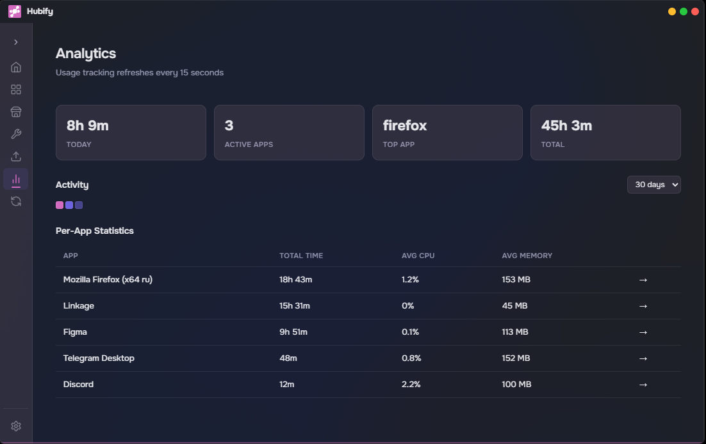
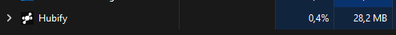

<div align="center">
  
  <h1 align="center">Hubify</h1>
  <p align="center">A high-performance, native Windows application launcher built with Tauri & Rust</p>

  <p>
    <a href="https://github.com/ManHuman504/Hubify/releases">
      
    </a>
    <a href="https://github.com/ManHuman504/Hubify/releases">
      
    </a>
    <a href="https://www.rust-lang.org/">
      
    </a>
    <a href="https://react.dev/">
      
    </a>
    <a href="https://v2.tauri.app/">
      
    </a>
  </p>
</div>

<p align="center">
  
</p>

---

**Hubify** is a blazingly fast, highly optimized native Windows application launcher. Manage all your applications, monitor system resources, and declutter your digital workspace — all from one beautiful interface built with Rust and modern web technologies.

---

## ✨ Features at a Glance

<table>
  <tr>
    <td width="50%" align="center">
      
    </td>
    <td width="50%" valign="top">
      <h3>🗂️ Smart Groups & Instant Search</h3>
      <p>Organize your apps into custom groups — separate work, games, and utilities. The native <strong>reEverything</strong> search engine (a full-fledged Everything clone) is built directly into the search bar. Search the entire system in milliseconds, or use the standalone tool in <strong>Tools</strong> for advanced filtering by file type.</p>
      <ul>
        <li>Create unlimited custom groups</li>
        <li>Drag & drop organization</li>
        <li>Integrated system-wide search</li>
        <li>Advanced category filters (docs, images, audio, code, etc.)</li>
      </ul>
    </td>
  </tr>
</table>

<table>
  <tr>
    <td width="50%" valign="top">
      <h3>📦 Native Winget Store</h3>
      <p>Browse and install thousands of applications directly through the built-in store, powered by the Windows Package Manager (winget). Search, discover, and install with one click — fast, safe, and always up-to-date.</p>
      <ul>
        <li>Full winget integration</li>
        <li>One-click installation</li>
        <li>Version details & descriptions</li>
        <li>No external dependencies</li>
      </ul>
    </td>
    <td width="50%" align="center">
      
    </td>
  </tr>
</table>

---

## 🛠️ 4 Built-in Tools

<table>
  <tr>
    <td width="50%" valign="top">
      <h3>🗑️ Deep Uninstaller</h3>
      <p>A native replacement for tools like Geek Uninstaller. Remove any application completely — including residual files, folders, and registry entries that standard uninstallers leave behind.</p>
      <ul>
        <li>Uninstall directly from the main page</li>
        <li>Or browse all installed apps via <strong>Tools → Deep Uninstaller</strong></li>
        <li>Deep scan for leftover files & registry keys</li>
        <li>Clean everything in one click</li>
      </ul>
      <blockquote><strong>⚠️ Early Version Warning:</strong> The Deep Uninstaller scans broadly and may occasionally flag important system files as leftovers. Always review the list of found residuals before deleting. We recommend using it alongside your standard uninstaller for now.</blockquote>
    </td>
    <td width="50%" valign="top">
      <h3>🚀 Startup Manager</h3>
      <p>Take control of everything that launches when Windows starts. View all registered startup items and enable or disable them with a single toggle.</p>
      <ul>
        <li>Full registry-based startup list</li>
        <li>One-click enable / disable</li>
        <li>Instant apply — no restart needed</li>
      </ul>
      <h3>📋 Activity Journal</h3>
      <p>Track application usage over time — see which apps you use most, for how long, and with what resource impact. Daily breakdowns with CPU and memory history.</p>
      <ul>
        <li>Per-app daily detail</li>
        <li>CPU & memory averages</li>
        <li>Hourly activity sparklines</li>
      </ul>
      <blockquote><strong>⚠️ Note:</strong> The Activity Journal is still in active development. Time tracking and resource stats may not be fully accurate in the current version.</blockquote>
    </td>
  </tr>
</table>

---

## 📊 System Analytics

<p align="center">
  
</p>

The **Analytics** dashboard gives you a clear overview of your system and application performance:
- **Today's Summary** — total active time, active apps, top application
- **Contribution Graph** — GitHub-style activity heatmap for daily usage
- **Per-App Statistics** — total time, average CPU, average memory
- **Network Connections** — live monitoring of per-app network activity
- **Hourly Breakdown** — when your apps are most active during the day

All data refreshes automatically every 15 seconds for near-real-time monitoring.

---

## 🎨 Themes & Customization

<p align="center">
  
</p>

Hubify comes with a rich set of built-in themes and the ability to create your own:

<table>
  <tr>
    <td valign="top">
      <h4>Built-in Themes</h4>
      <ul>
        <li>🌙 <strong>Dark</strong> — Classic dark</li>
        <li>☀️ <strong>Light</strong> — Clean light</li>
        <li>💜 <strong>Neo</strong> — Cyberpunk green</li>
        <li>🌸 <strong>Neo Retro</strong> — Pastel purple</li>
        <li>🌌 <strong>Midnight</strong> — Deep blue</li>
        <li>🌅 <strong>Sunset</strong> — Warm orange</li>
        <li>🌲 <strong>Forest</strong> — Natural green</li>
        <li>🧊 <strong>Nord</strong> — Arctic frost</li>
        <li>🌃 <strong>Synthwave</strong> — Neon retro</li>
      </ul>
    </td>
    <td valign="top">
      <h4>Custom Themes</h4>
      <p>Create your own themes with a custom color editor. Pick your accent, backgrounds, text colors, and borders — every visual aspect is customizable. Share your themes with the community!</p>
    </td>
  </tr>
</table>

---

## 🔐 Startup Guard

<p align="center">
  
</p>

Hubify's **Startup Guard** runs silently in the background and monitors for any application trying to register itself in Windows autostart. When detected, a modal window appears asking you to **Allow** or **Deny** the change — giving you full control over what runs at startup.

---

## 🖥️ Tray Integration

<p align="center">
  
</p>

Hubify lives in your system tray for quick access:
- Pin Hubify to your taskbar for one-click app launching
- See which of your added applications are currently running
- Restore minimized windows instantly
- Access all your apps without leaving the tray

---

## ☁️ Sync *(Coming Soon)*

A future update will introduce **Hubify Sync** — seamlessly synchronize your applications, groups, and settings across devices:

- **Cloud backup** — your configuration, always safe
- **One-click restore** — reinstall Windows, install Hubify, and restore everything in a single click
- **Smart detection** — paid or unavailable apps are listed separately so you know what needs manual reinstallation

---

## 💡 Resource Efficiency

<p align="center">
  
</p>

Thanks to its Rust-powered backend, Hubify is extremely lightweight:
- **~50 MB RAM** at idle
- **~0.4% CPU** in the background
- Native performance with no Electron overhead
- Minimal disk footprint

---

## 🚀 Getting Started

### Prerequisites
- Windows 10 or later
- [WebView2](https://developer.microsoft.com/en-us/microsoft-edge/webview2/) (included with Windows 11)

### Installation
1. Download the latest MSI installer from the [Releases](https://github.com/ManHuman504/Hubify/releases) page
2. Run the installer and follow the setup wizard
3. Launch Hubify and complete the one-time setup (winget detection, initial scan)
4. Start adding your applications!

### Build from Source
```bash
git clone https://github.com/ManHuman504/Hubify.git
cd Hubify
npm install
npm run tauri build
```
The installer will be at `src-tauri/target/release/bundle/msi/`

---

## 🛡️ Privacy

Hubify operates entirely locally. No telemetry, no data collection, no cloud uploads. Your application list, usage data, and settings never leave your machine. Sync (when available) will be opt-in and end-to-end encrypted.

---

## 📄 License

Distributed under the MIT License. See `LICENSE` for more information.

---

<div align="center">
  <p>
    <a href="https://github.com/ManHuman504/Hubify">GitHub</a> •
    <a href="https://github.com/ManHuman504/Hubify/releases">Releases</a> •
    <a href="https://github.com/ManHuman504/Hubify/issues">Issues</a>
  </p>
  <p>Built with ❤️ using <a href="https://v2.tauri.app/">Tauri</a>, <a href="https://react.dev/">React</a> & <a href="https://www.rust-lang.org/">Rust</a></p>
</div>
